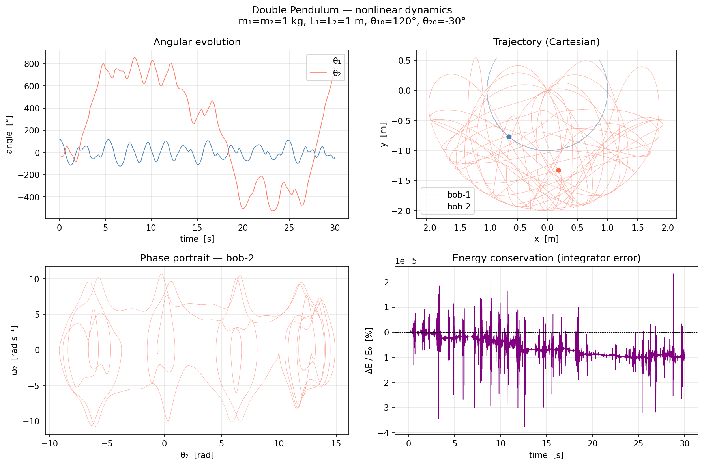

# WIP: MathPhys — Double Pendulum Simulation

> Exact nonlinear double-pendulum dynamics implemented in five languages,
> with a real-time interactive browser visualization.
>
> > 5つの言語で実装された正確な非線形二重振り子動力学、リアルタイム対話型ブラウザ可視化付き。


| Language | Integrator | Output |
|---|---|---|
| **Python** | adaptive RK45 (SciPy DOP853, rtol=1e-9) | matplotlib figure, CSV |
| **C++** | fixed-step RK4 | CSV files |
| **Rust** | fixed-step RK4 | CSV files |
| **Julia** | fixed-step RK4 | CSV files |
| **JavaScript / TypeScript** | fixed-step RK4 | live browser canvas |

---

## Physics

The system consists of two point masses on massless rigid rods attached at a
fixed pivot. Angles are measured from the downward vertical.

> このシステムは、固定された支点に取り付けられた質量のない剛体棒上の2つの点質量で構成される。角度は下向きの垂直方向から測定される。

**Parameters (defaults)**

| Symbol | Value | Description |
|---|---|---|
| m₁, m₂ | 1 kg | Bob masses |
| L₁, L₂ | 1 m | Rod lengths |
| g | 9.81 m s⁻² | Gravitational acceleration |

**Euler–Lagrange equations of motion**

$$\ddot{\theta}_1 = \frac{-g(2m_1+m_2)\sin\theta_1 - m_2 g\sin(\theta_1-2\theta_2) - 2\sin\Delta\cdot m_2(\dot\theta_2^2 L_2 + \dot\theta_1^2 L_1\cos\Delta)}{L_1\,D}$$

$$\ddot{\theta}_2 = \frac{2\sin\Delta\!\left[\dot\theta_1^2 L_1(m_1+m_2)+g(m_1+m_2)\cos\theta_1+\dot\theta_2^2 L_2 m_2\cos\Delta\right]}{L_2\,D}$$

where $\Delta = \theta_1 - \theta_2$ and $D = 2m_1 + m_2 - m_2\cos 2\Delta$.

**Total mechanical energy** $E = T + V$ is conserved; all implementations track $\Delta E / E_0$ as an integrator quality metric.

**Canonical initial conditions**

| Preset | θ₁ | θ₂ | Behaviour |
|---|---|---|---|
| Near-linear | 10° | 10° | Small oscillations, quasi-periodic |
| Intermediate | 90° | 0° | Mixed regular / chaotic |
| Chaotic | 120° | −30° | Sensitive to initial conditions, fully chaotic |

---

## Interactive Browser Demo

The fastest way to explore the system — no installation required:

```bash
# open the pre-built app directly:
open js/dist/index.html
```

Or run the development server with hot reload:

```bash
cd js
npm install
npm run dev
# → http://localhost:5173
```

The app renders four live panels:

| Panel | Description |
|---|---|
| **Pendulum** | Swinging rods with trailing bob-2 path |
| **Phase portrait** | θ₂ vs ω₂, accumulates indefinitely |
| **Trajectory** | Bob-2 Cartesian path x₂, y₂ |
| **Energy** | Kinetic T, potential V and total E vs time |

Controls: preset buttons · θ₁/θ₂/ω₁/ω₂ sliders · Play / Pause / Reset · speed ×½ ×1 ×2 ×5 · live Δ*E*/E₀ readout.



---

## Repository layout

```
.
├── python/               # Python package (mathphys)
│   ├── src/mathphys/
│   │   ├── double_pendulum.py
│   │   └── numerics.py
│   ├── tests/
│   └── examples/double_pendulum_demo.py
│
├── cpp/                  # C++20 library + CMake
│   ├── include/
│   ├── src/
│   ├── tests/
│   └── examples/dp_sim.cpp
│
├── rust/                 # Rust crate (nalgebra)
│   ├── src/
│   │   ├── double_pendulum.rs
│   │   ├── numerics.rs
│   │   └── bin/dp_sim.rs
│   └── Cargo.toml
│
├── julia/                # Julia package (MathPhys.jl)
│   ├── src/
│   ├── tests/
│   └── examples/dp_sim.jl
│
├── js/                   # TypeScript browser app (Vite)
│   ├── src/
│   │   ├── double_pendulum.ts
│   │   └── main.ts
│   ├── index.html
│   └── dist/             # pre-built — open in any browser
│
└── pyproject.toml        # Python project metadata
```

---

## Setup & Usage

### Python

**Requirements:** Python 3.11+, pip

```bash
pip install -e .                          # install the mathphys package

python python/examples/double_pendulum_demo.py   # saves double_pendulum.png
pytest python/tests/                      # run tests
pytest --cov=mathphys python/tests/       # with coverage
```

The demo uses SciPy's `solve_ivp` with the DOP853 adaptive integrator
(rtol=1e-9, atol=1e-11), then plots θ₁/θ₂, ω₁/ω₂, phase portraits and
energy drift on a single figure.

---

### C++

**Requirements:** CMake ≥ 3.20, a C++20-capable compiler (GCC 12+ / Clang 15+)

```bash
mkdir -p cpp/build && cd cpp/build
cmake ..
cmake --build .

ctest --output-on-failure     # run tests
./dp_sim_exec                 # generate 8 CSV scenarios
```

The example writes one CSV per scenario (`case_*.csv`, `sensitivity_*.csv`,
`mass_ratio_*.csv`) with columns: `t, theta1, omega1, theta2, omega2, x2, y2, energy`.

To quantify chaos from nearly identical starts (sensitivity A/B), run:

```bash
python cpp/examples/sensitivity_report.py sensitivity_a.csv sensitivity_b.csv
```

---

### Rust

**Requirements:** Rust 1.75+ (stable), Cargo

```bash
cd rust
cargo test                         # unit tests (inline + integration)
cargo run --bin dp_sim --release   # generate 8 CSV scenarios
```

The crate uses [nalgebra](https://nalgebra.org/) for vector types. The same
8 CSV scenarios are produced as the C++ version.

---

### Julia

**Requirements:** Julia 1.10+

```bash
# Run tests
julia --project=julia julia/tests/runtests.jl

# Generate CSV scenarios
julia --project=julia julia/examples/dp_sim.jl
```

Julia is not required for the rest of the project. If `julia` is not in `PATH`
the session-start hook will skip it gracefully.

---

### JavaScript / TypeScript

**Requirements:** Node.js 18+ (only for the dev server — the `dist/` bundle
needs no build step)

```bash
cd js
npm install          # first time only
npm run dev          # development server with HMR → localhost:5173
npm run build        # rebuild dist/
npm run preview      # serve the production build locally
```

TypeScript is compiled by Vite (transpile-only); run `npx tsc --noEmit` for
full type checking.

---

## Tests

| Language | Framework | Command |
|---|---|---|
| Python | pytest | `pytest python/tests/` |
| C++ | CTest | `ctest` (inside `cpp/build/`) |
| Rust | built-in + approx | `cargo test` (inside `rust/`) |
| Julia | @testset | `julia --project=julia julia/tests/runtests.jl` |

All numerics tests cover `integrate_trapezoid` and `finite_difference`
with known analytic solutions (constant, linear, quadratic, sinusoidal).

---

## Energy conservation

A correctly implemented RK4 integrator with dt = 1 ms keeps relative energy
drift $|\Delta E / E_0|$ below 10⁻⁶ for the 30-second chaotic scenario. The
Python adaptive solver maintains drift below 10⁻⁸.

The browser app displays the live drift percentage next to the simulation
clock so you can verify conservation interactively.
